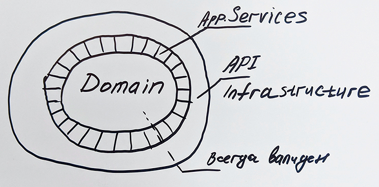

## POV: DDD: Всегда валидная доменная модель ValueObject

Подход проверен на практике на двух проектах в ГПБ

- МВНО
- Цифровой Рубль

О чем хочу поговорить:

Код - универсальный интерфейс взаимодействия разработчиков, сервисов
Код может быть понятным

В основе моей вселенной
### Designing with types
(Making illegal states unrepresentable)[https://fsharpforfunandprofit.com/posts/designing-with-types-making-illegal-states-unrepresentable/]

Scott 

- Ссылка на git [https://t.ly/pwgy](https://t.ly/pwgy)


email: maxim[at]codemonsters.team\
https://t.me/codemonsterslogs
 
>DDD is not Done!   
>DDD 20 years

---

На автора оказали влияние работы инженеров:\
[Владимира Хорикова](https://enterprisecraftsmanship.com/), [Скотта Влашина](https://fsharpforfunandprofit.com/), [Роберта Мартина](https://cleancoders.com/)  

Устремления к эффективным действиям, продуктивной работе и достижениям.

---

## Сильная Доменная модель | Rich Domain Model
Логика описана в доменных классах, не в сервисах:

````kotlin
//AggregateRoot
data class SubscriberDataUpdate private constructor(
    private val dataUpdate: DataUpdate,
    private val subscriber: Subscriber
) {

    fun prepareUpdateRequest(): Result<SubscriberUpdateRequest> =
        when (isUpdateRequired()) {
            true -> createSubscriberUpdateRequest()
            else -> failNoUpdateRequired()
        }

    private fun isUpdateRequired(): Boolean =
        subscriber.mobileRegionId != dataUpdate.mobileRegionId

    private fun failNoUpdateRequired(): Result<SubscriberUpdateRequest> =
        Result.failure(RuntimeException("No Update Required"))

    private fun createSubscriberUpdateRequest()
            : Result<SubscriberUpdateRequest> =
        Result.success(
            SubscriberUpdateRequest(
                subscriberId.value,
                dataUpdate.msisdn.value,
                dataUpdate.mobileRegionId.value,
                this
            )
        )
}
````
#### Бенефиты:
- бизнес-логика собрана в одном месте Domain Layer
- направляет нас на подконтрольное создание, проверку и управление сущностью, предотвращая появление у клиента сущностей с несогласованным состоянием сразу в одном месте
- код превращается в документацию, которую просто тестировать

### Не используй анти-паттерн [Слабая Доменная Модель](https://www.martinfowler.com/bliki/AnemicDomainModel.html)  

````kotlin 
      data class Subscriber(
            val subscriberId: String,
            val msisdn: String, 
            val mobileRegionId: String
      )
  
````

#### Чем плоха слабая доменная модель?
- Инкапсуляция нарушена
- Приводит всегда к Дублированию бизнес-логики
- Невозможно гарантировать, что объекты в модели находятся в согласованном состоянии
- всегда способствует разрыву и непониманию между разработкой и бизнесом
- всегда приводит к описанию бизнес-логики в отдельном месте, например сервисе и сливается в этом случае с интеграцией.

чем плохо слияние с интеграцией?

- тем что тестирование бизнес-логики возможно только с моками
- Чем опасны интеграционные тесты описано [в моей статье на Хабре](https://habr.com/ru/companies/gazprombank/articles/722620/)
- Слабая доменная модель - [**описание анти-паттерна сайте Martin Fowler**](https://martinfowler.com/bliki/AnemicDomainModel.html)

### Мы описали класс сильной доменной моделью, протестируем его?  

````kotlin
internal class SubscriberDataUpdateTest {

    @Test
    fun success() {
        //arrange
        val foundDataUpdateDto = DataUpdateDto(
            dataUpdateId = "101",
            subscriberId = "888",
            msisdn = "3338887770",
            mobileRegionId = "9" //<
        )
        val foundSubscriberDto = SubscriberDto(
            subscriberId = "888",
            msisdn = "3338887770",
            mobileRegionId = "0" //<
        )

        val dataUpdate = DataUpdate.emerge(
            foundDataUpdateDto
        ).getOrThrow()
        val subscriberResult = Subscriber.emerge(
            foundSubscriberDto
        )
        //^ воссоздаем необходимое нам состояние Обновление абонента
        //act
        val sut = SubscriberDataUpdate.emerge(dataUpdate, subscriberResult)
        //assert
        //i like fluent assertion library assertJ
        assertThat(sut.isSuccess).isTrue
        assertThat(sut.getOrThrow().prepareUpdateRequest().isSuccess).isTrue
        val subscriberUpdateRequest = sut.getOrThrow()
            .prepareUpdateRequest().getOrThrow()
        assertThat(subscriberUpdateRequest.subscriberId).isEqualTo("888")
        assertThat(subscriberUpdateRequest.msisdn).isEqualTo("3338887770")
        assertThat(subscriberUpdateRequest.mobileRegionId).isEqualTo("9")
    }
    
    //fails in da src

}
````
## DDD :: Aggregate

Eric Avans:
> An AGGREGATE is a cluster of associated objects that we treat as a unit for the purpose of data changes.

Scott Wlaschin:
> An aggregate plays an important role when data is updated. The aggregate acts as the consistency boundary: when one part of the aggregate is updated, other parts might also need to be updated to ensure consistency.  
>
> The aggregate is also where any invariants are enforced.
>

````kotlin
//AggregateRoot
data class SubscriberDataUpdate private constructor(
    private val dataUpdate: DataUpdate,
    private val subscriber: Subscriber
) {
    fun prepareUpdateRequest(): Result<SubscriberUpdateRequest> = {..}
    private fun isUpdateRequired(): Boolean = {..}
    private fun failNoUpdateRequired(): Result<SubscriberUpdateRequest> = {..}
    private fun createSubscriberUpdateRequest(): Result<SubscriberUpdateRequest> = {..}
}
````

---

## TDD :: Type Driven Development как защита от багов на уровне компиляции
  
>Кодопись без примитивов в ядре доменной модели - сам себя тестирует  
>и описывает ограничения предусмотренные бизнес-логикой.  
>Код есть документация.  
>Появляется Единственная точка входа в процесс валидации.  

Реализация Тактического Паттерна **DDD: ValueObject**
> ValueObject - Основной кирпичик описания модели - это важно понимать.
> Помогает строить всегда валидную доменную модель!


Пример SubscriberId:  

````kotlin
data class SubscriberId
private constructor(
    override val value: String
) : ValueObject<String> {
    companion object {
        fun emerge(subscriberId: String)
                : Result<SubscriberId> =
            when (isStringConsists6Digits(subscriberId)) {
                true -> Result.success(SubscriberId(subscriberId))
                else -> Result.failure(IllegalArgumentException("..."))
            }

        private val isStringConsist6Digits = "^\\d{1,6}\$".toRegex()

        private fun isStringConsists6Digits(value: String) =
            isStringConsist6Digits.matches(value)
    }
} 
````

Представили Тест на эту логику?

````kotlin
internal class SubscriberIdTest {
  @Test
  fun success() {
    val sut = SubscriberId.emerge("888")
    assertThat(sut.isSuccess).isTrue
    assertThat(sut.getOrThrow().value).isEqualTo("888")
  }

  @Test
  fun successWith6Digits() {
    val sut = SubscriberId.emerge("123456")
    assertThat(sut.isSuccess).isTrue
    assertThat(sut.getOrThrow().value).isEqualTo("123456")
  }

  @Test
  fun failWithWrongFormat() {
    val sut = SubscriberId.emerge("L124S")
    assertThat(sut.isFailure).isTrue
    assertThat(sut.exceptionOrNull()!!.message).isEqualTo("Subscriber Id consists of numbers maximum length 6")
  }

}
````

## Всегда валидная Последовательность алгебраических типов

> DDD made functional

Для описания Доменных классов в функциональном стиле помогает  
описать бизнес-процесс в цепочке перетекающих классов друг в друга:  

Постановка:    

````
| запросить данные для обновления абонента
| запросить текущие данные абонента в системе
| сформировать запрос на обновление абонента
| отправить запрос обновления данных абонента
````
Последовательность алгебраических типов:  

```
| Непроверенный Запрос на Обновление | UnvalidatedDataUpdateRequest
| Проверенный Запрос На Обновление   | ValidatedDataUpdateRequest
| Запрос Абонента В Системе          | SubscriberDataUpdate
| Запрос На Обновление Абонента      | SubscriberUpdateRequest
| Результат Обновления Абонента      | SubscriberDataUpdateResponse
```

Пример плохого возможно Невалидного Доменного класса:
````kotlin
   class SubscriberDataUpdate(
           val subscriber: Subscriber?, 
           val dataUpdate: SubscriberDataUpdate
     ) {
           fun isValid() = null != subscriber

           fun isUpdateRequired() = 
              subscriber.mobileRegionId != dataUpdate.mobileRegionId 
   }
````

Всегда валидная Доменная модель возникает только благодаря фабричным методам,\
или не возникает вовсе:

````kotlin   
data class SubscriberDataUpdate private constructor(
    private val dataUpdate: DataUpdate,
    private val subscriber: Subscriber
) {
    fun prepareUpdateRequest(): Result<SubscriberUpdateRequest> = {..}

    private fun failNoUpdateRequired(): Result<SubscriberUpdateRequest> = {..}

    private fun createSubscriberUpdateRequest()
            : Result<SubscriberUpdateRequest> = {..}
        
    private fun isUpdateRequired(): Boolean = {..}
    
    companion object {
        fun emerge(
            dataUpdate: DataUpdate,
            subscriberResult: Result<Subscriber>
        ): Result<SubscriberDataUpdate> =
            subscriberResult.map {
                SubscriberDataUpdate(dataUpdate, it)
            }
    }
    
}
````

- Остановись на валидации Запроса
> | Непроверенный Запрос на Обновление | UnvalidatedDataUpdateRequest

 
> DTO -> UnvalidatedDataUpdateRequest(a: String, b:String, c: String, d: String)
> 
> Result.zip(ValueObject<A>, ValueObject<B>, ValueObject<C>, ValueObject<D>).map{..}

````kotlin
fun <A : Any, B : Any, C : Any, D : Any> Result.Companion.zip(a: Result<A>, b: Result<B>, c: Result<C>, d: Result<D>)
: Result<Tuple4<A, B, C, D>> =
    if (sequenceOf(a, b, c, d).none { it.isFailure })
        Result.success(Tuples.of(a.getOrThrow(), b.getOrThrow(), c.getOrThrow(), d.getOrThrow()))
    else
        Result.failure(sequenceOf(a, b, c, d).first { it.isFailure }.exceptionOrNull()!!)
````

#### Onion Architecture : Изолируем доменную модель от интеграций

[Onion Architecture](http://jeffreypalermo.com/blog/the-onion-architecture-part-1/)

Уровень сервисов используем как простой поток **dump pipe**

Как это помогает в **тестописи**?



Постановка:
````
| запросить данные для обновления абонента
| запросить текущие данные абонента в системе
| сформировать запрос на обновление абонента
| отправить запрос обновления данных абонента
````
Пример сервиса с Сильной Доменной Моделью:

````kotlin
    fun subscriberUpdate(unvalidatedUpdateRequest: UnvalidatedDataUpdateRequest)
            : Mono<Result<SubscriberDataUpdateResponse>> =
        Mono.just(ValidatedDataUpdateRequest.emerge(unvalidatedUpdateRequest))
            .pipe { findDataForUpdate(it) }
            .pipe { findSubscriber(it) }
            .mapResult { it.prepareUpdateRequest() }
            .pipe { updateSubscriber(it) }

    ****

     private fun findSubscriberForUpdate(dataUpdate: Result<DataUpdate>)
            : Mono<Result<SubscriberDataUpdate>> =
        dataUpdate.fold(
            onSuccess = { subscriberRequest -> findSubscriberByRest(subscriberRequest) },
            onFailure = { error -> Mono.just(Result.failure(error)) }
        )

     private fun findSubscriberByRest(dataUpdate: DataUpdate)
        : Mono<Result<SubscriberDataUpdate>> =
        _subscribersClient.findSubscriber(dataUpdate.subscriberId)
        .map { SubscriberDataUpdate.emerge(dataUpdate, it) }

````
Пример на конве Влашина и из наших примеров
Простой:
```
data class Contact(
    name: Name,
    emailContactInfo: EmailContactInfo,
    postalContactInfo: PhoneContactInfo
)
```

Есть три кейса:

- Контакт имеет только email address
- Контакт имеет только phone
- Контакт имеет email address and phone

Как мы это распишем на kotlin?
```

```

Смотра как это можно расписать на F#

### Вывод:

Во-первых, бизнес-логика сложна. Нет простого способа избежать этого. 
Если ваш код не такой сложный, вы не обрабатываете все случаи должным образом.

Во-вторых, если логика представлена типами, она автоматически самодокументируется. 
Вы можете посмотреть примеры союзов ниже и сразу увидеть, что такое бизнес-правило. 
Вам не нужно тратить время на анализ любого другого кода.

### Как нам домен сохранить в СУБД?
Как поживает наш прекрасный ОРМ?

Тут добавить шестигранник

И показать что слой хранения он живет отдельно
его можно вынести отдельно
а можно оставить в сервисе
но тогда сервис становится большим
тестов становится больше
в голове его уместить сложнее
или у меня голова маленькая?
Проблема в правильном связывании этих сервисов и сохранении единой точки входа
И тут срабатывает развязывание