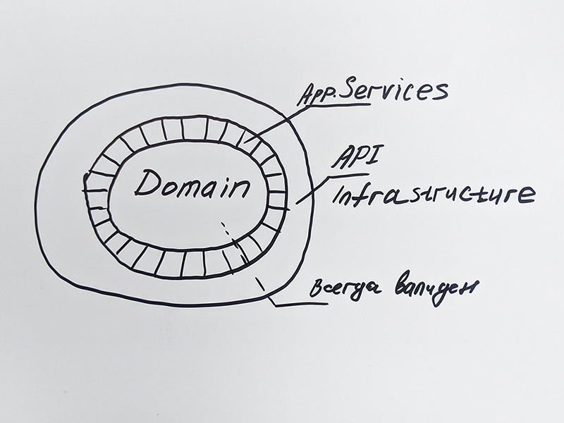
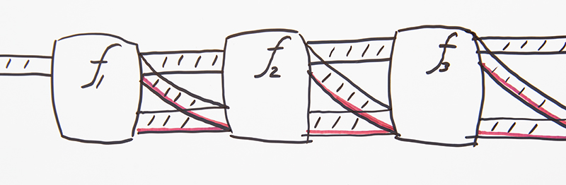
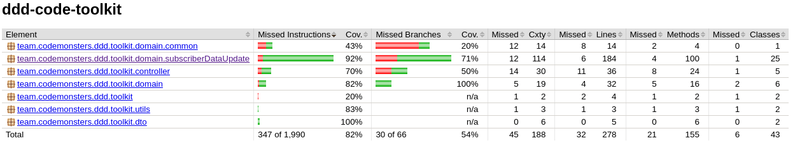
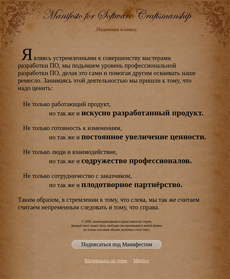

# ddd-code-cookbook

5 приемов, которые помогают в борьбе за чистый код
при разработке приложений по DDD&TDD

Ссылка на git


email: maxim[at]codemonsters.team\
https://t.me/maxology

«I am strong believer in a “begin with the concrete, and move to the abstract” pedagogical approach» © [Scott Wlaschin](https://fsharpforfunandprofit.com/about/)


«The problem contains the solution»

---

## **Цель:**
Повысить качество кода разработки приложений с бизнес-логикой
- [x] Снизить стоимость доработок
- [x] Снизить стоимость поддержки
- [x] Снизить стоимость погружения новичков
- [x] Сокращения количества ошибок

Высвободить время лида разработки на программирование и развитие за счет:
- [x] Повышения эффективности делегирования
- [x] Сокращения времени на встречи «погружения разработчиков» в методологию
- [x] Сокращения времени на проверку кода
- [x] Сокращения времени на осознание кода


## **Задача:**

````
  Найти рецепт на основе лучших практик, который поможет: 
  в рефакторинге, 
  в создании приложений с бизнес-логикой 
  с использованием практичных юнит-тестов, функциональной парадигмы.
  Применить подход на практике.
  Описать кратко и доступно рецепт.
  Внедрить в команде.
````
---
На автора оказали влияние работы инженеров:\
[Владимира Хорикова](https://enterprisecraftsmanship.com/), [Скотта Влашина](https://fsharpforfunandprofit.com/), [Роберта Мартина](https://cleancoders.com/)

## «Рецепт» разработки бизнес-логики в функциональном стиле с примерами на Kotlin:
- **DDD** :: общаемся с экспертами и проектируем бизнес-логику вместе

  - [x] Единый язык в документации, коде, в общении с экспертами домена
  - [x] **Опиши в функциональном стиле бизнес-процесс с доменными классами**\
    Пример:\
    Чтобы актуализировать данные по абоненту в системе, необходимо:
    ````
    | запросить данные для обновления абонента 
    | запросить текущие данные абонента в системе
    | сформировать запрос на обновление абонента
    | отправить запрос обновления данных абонента
    ````
    ^ хорошо помогает в рефакторинге
    
    Как часто бывает, не делай так:
    ````
     0. Снять с себя ответственность и кодить по постановке
     1. В таблице <обновление_данных> взять все строки со статусом need_to_update
     2. В таблице абонента взять данные по абоненту по идентификатору <обновление_данных>.subscriber_id, если таких данных нет, пометить ошибкой  
     3. Сверить строки как то так.
     4. Если данные отличаются см. пункт 5
     5. Отдельная страница в конфлюенс на два скрола со сложной логикой обновления данных, сиквенс диаграммой и т.д.
    ````
  - [x] Забудь Table-Driven Design (Database Oriented мышление) - используй только Доменные объекты при обсуждении задачи. Не думай о низкоуровневой реализации.  
  - [x] Используй в коде Сильную Доменную модель - вся логика описана в доменных объектах, не в сервисах:
    
    ````
        class SubscriberDataUpdate(
              val subscriber: Subscriber, 
              val dataUpdate: SubscriberDataUpdate
        ) {
              fun isUpdateRequired(): Boolean = 
                 subscriber.mobileRegionId != dataUpdate.mobileRegionId 
        }
    ````
  
    Не используй анти-паттерн Слабая Доменная Модель > [Anemic Domain Model](https://www.martinfowler.com/bliki/AnemicDomainModel.html):
    ```` 
        data class Subscriber(
              val subscriberId: String,
              val msisdn: String, 
              val mobileRegionId: String
        )
    
    ````
    
    Пример плохой реализации со слабой доменной моделью и бизнес-логикой в сервисе:
      ````
       @Service
       class SubscriberDataUpdateService(
         val subscriberGateWay: SubscriberGateway, 
         val dataUpdate: SubscriberDataUpdateGateway
       ) {
    
            fun dataUpdateProcess() {                                                         
                updateSubscriber(
                     dataUpdate.getDataForUpdate()
                )                                                                          
            }  
             //^ бизнес-логика и интеграции находятся в сервисах 
             // обычно их много и разработчик 
             // занят детективным расследованием при любой доработке
             // доменные модели при этом выступают в роли контейнера данных
             // код обрастает комментариями - а это плохой признак
      
            private fun updateSubscriber(
                           dataUpdate: SubscriberDataUpdate
            ) {
                val subscriber = 
                    subscriberGateWay.finedById(dataUpdate.subscriberId)
                                                                  
                if (isUpdateRequired(subscriber, subscriberDataUpdate))
                     //^ бизнес-логика
                      updateSubscriberWithData(subscriber, subscriberDataUpdate)                      
            }
              
            private fun isUpdateRequired(
                             subscriber: Subscriber, 
                             dataUpdate: SubscriberDataUpdate
            ) =
                  subscriber.modileRegionId != dataUpdate.mobileRegionId 
      
            private fun updateSubscriberWithData(
                             subscriber: Subscriber, 
                             dataUpdate: SubscriberDataUpdate
            ) {

                val updateSubscriberDto = 
                                   SubscriberDto( 
                                      subscriber.subscriberId, 
                                      dataUpdate.mobileRedionId
                )                     //^ бизнес-логика
                subscriberGateWay.updateSubscriber(
                         updateSubscriberDto
                )        //^ может вылететь исключение  
                                  
                // далее сложная логика по обновлению взаимосвязанных сущностей с Subscriber 
                // логика растеклась, границ у Доменов нет
                if (subscriber.msisdn != dataUpdate.msisdn) {
                   updateMnp(subscriber, subscriberDataUpdate)
                   updateLoyalty(subscriber, subscriberDataUpdate)     
                }
            }
       }
      ````
    
  - [x] Изолируем доменную модель от интеграций с внешними системами\
    [Onion Architecture](http://jeffreypalermo.com/blog/the-onion-architecture-part-1/) \
    Уровень сервисов используем как простой поток\
    А простые юнит-тесты без заглушек покрывают всю бизнес-логику\
    
  
    Постановка:
      ````
      | запросить данные для обновления абонента
      | запросить текущие данные абонента в системе
      | сформировать запрос на обновление абонента
      | отправить запрос обновления данных абонента
      ````
    Пример сервиса с Сильной Доменной Моделью:
      ````
       @Service
       ...
       fun dataUpdateProcess(unvalidatedUpdateRequest: UnvalidatedDataUpdateRequest)
            : Mono<Result<SubscriberDataUpdateResponse>> =
        Mono.just(ValidatedDataUpdateRequest.emerge(unvalidatedUpdateRequest))
            .flatMap { findDataWithUpdates(it) }
            .flatMap { findSubscriberForUpdate(it) }
            .flatMap { prepareSubscriberUpdateRequest(it) }
            .flatMap { updateSubscriber(it) }          
           ...
           ...

        private fun prepareSubscriberUpdateRequest(subscriberDataUpdate: Result<SubscriberDataUpdate>)
            : Mono<Result<SubscriberUpdateRequest>> =
        subscriberDataUpdate.fold(
            onSuccess = { it.prepareUpdateRequest() },
                          //^ бизнес-логика в Доменном классе
            onFailure = { Result.failure(it) }
        ).toMono()

      ````
  - [x] **Реализуй в функциональном стиле всегда валидную Богатую Доменную Модель**\
    Без примитивов в сердце доменных классов (типов). 
    Последовательность классов, пронизывающую процесс,\
    можно описать так:

    - Постановка:
    ````
      | запросить данные для обновления абонента
      | запросить текущие данные абонента в системе
      | сформировать запрос на обновление абонента
      | отправить запрос обновления данных абонента
    ````
    - Последовательность алгебраических типов:
      
    ````
      > Непроверенный Запрос на Обновление | UnvalidatedDataUpdateRequest
      > Проверенный Запрос На Обновление   | ValidatedDataUpdateRequest
      > Запрос Абонента В Системе          | SubscriberDataUpdate
      > Запрос На Обновление Абонента      | SubscriberUpdateRequest
      > Результат Обновления Абонента      | SubscriberDataUpdateResponse
    ````
      
     Пример плохого возможно Невалидного Доменного класса:
     ````
        class SubscriberDataUpdate(
                val subscriber: Subscriber?, 
                val dataUpdate: SubscriberDataUpdate
          ) {
                fun isValid() = null != subscriber
    
                fun isUpdateRequired() = 
                   subscriber.mobileRegionId != dataUpdate.mobileRegionId 
        }
     ````
     Всегда валидная Доменная модель возникает только благодаря фабричным методам,\
     или не возникает вовсе:
     ````   
        data class SubscriberDataUpdate private constructor(
             private val dataUpdate: DataUpdate,
             private val subscriber: Subscriber
         ) {
       
           val subscriberId: SubscriberId = subscriber.subscriberId
           val dataUpdateId: DataUpdateId = dataUpdate.dataUpdateId
       
           fun prepareUpdateRequest()
           : Result<SubscriberUpdateRequest> 
           ...
           ...
    
           companion object {
               fun emerge(
                   dataUpdate: DataUpdate,
                   subscriberResult: Result<Subscriber>
               ): Result<SubscriberDataUpdate> =
                    //^ нет иной возможности в коде создать объект
                    // > Result<Data, Error> two-track type
                   subscriberResult.map {
                       SubscriberDataUpdate(
                           dataUpdate,
                           Subscriber(
                                   it.subscriberId, 
                                   it.msisdn, 
                                   it.mobileRegionId)
                           )
                   }
           }
       
       }
        
     ````
    - [x] TDD - Type Driven Development как защита от багов на уровне компиляции.\
      Код без примитивов - сам себя тестирует и описывает\
      ограничения предусмотренные бизнес-логикой.\
      Код - документация.\
      Появляется Единственная точка входа в процесс валидации.\
      ValueObject pattern - основной кирпичик описания модели - это важно понимать.\
      Пример SubscriberId:\
      ````
      data class SubscriberId 
      private constructor(override val value: String) 
      : ValueObject<String> {
        companion object {
         fun emerge(subscriberId: String)
         : Result<SubscriberId> =
           when (isStringConsists9Digits(subscriberId)) {
              true -> Result.success(SubscriberId(subscriberId))
              else -> Result.failure(IllegalArgumentException("Subscriber Id consists of numbers maximum length 9"))
           }

           private fun isStringConsists9Digits(value: String) =
             value.trim().isNotEmpty()
                    && value.length < 10
                    && value.lineSequence().all { it in "0".."9" }
           }
      }
      ````

---     
- **Не используем исключения при работе с ошибками в бизнес-процессе в качестве control flow**
  
  Исключения как инструмент мешают в восприятии бизнес-процесса,\
  как **непрерывного потока**.\
  [Railway Oriented Programming - error handling in functional languages](https://fsharpforfunandprofit.com/rop/)
   
  Последовательность классов:
   ````
      > Непроверенный Запрос на Обновление 
      > Проверенный Запрос На Обновление 
      > Запрос Абонента В Системе 
      > Запрос На Обновление Абонента 
      > Результат Обновления Абонента
   ````
    
  - [x] Не используем исключения в бизнес-процессе в качестве control flow.
  - [x] Только честные функции.\
    True function style\
    функция всегда возвращает ответ:\
    two track type **Result**<Data, Error>\
    если она может «сломаться» в процессе исполнения.\
    Пример сервиса с Сильной Доменной Моделью и R.O.P. :
     ````
       fun dataUpdateProcess(unvalidatedUpdateRequest: UnvalidatedDataUpdateRequest)
            : Mono<Result<SubscriberDataUpdateResponse>> =
        Mono.just(ValidatedDataUpdateRequest.emerge(unvalidatedUpdateRequest))
            .flatMap { findDataWithUpdates(it) }
            .flatMap { findSubscriberForUpdate(it) }
            .flatMap { prepareSubscriberUpdateRequest(it) }
            .flatMap { updateSubscriber(it) }          
           ...
           ...

        
        private fun prepareSubscriberUpdateRequest(subscriberDataUpdate: Result<SubscriberDataUpdate>) 
            : Mono<Result<SubscriberUpdateRequest>> =
        //^ > Result<SubscriberDataUpdate> > Result<SubscriberUpdateRequest>
        subscriberDataUpdate.fold(
            onSuccess = { it.prepareUpdateRequest() },
                          //^ бизнес-логика в Доменном классе
            onFailure = { Result.failure(it) }
                         //^ Проброс ошибки далее по пайпу
        ).toMono()    

     ````
  - [x] С two track type **Result**<Data, Error> обработка ошибок становится гражданином первого класса нашей модели.
  - [x] Не используем исключения в приложении в качестве control flow бизнес-процесса
  - [x] исключения - сигналы багов.
---
- **Функциональный подход** [Pipeline Oriented Programming](https://fsharpforfunandprofit.com/pipeline/) при проектировании кода с бизнес-логикой
  - [x] **Запусти Доменную Модель по тоннелю «бизнес-процесс» без исключений, на шлюзах поможет two track type Result<Data, Error> и canExecute/execute**\
    Описанный код бизнес-логики должен выглядеть структурно, подобно постановке:\
    Постановка:
    ````
    | запросить данные для обновления абонента
    | запросить текущие данные абонента в системе
    | сформировать запрос на обновление абонента
    | отправить запрос обновления данных абонента
    ````
    Пример хорошего кода приложения в функциональном стиле:
    ````
        fun dataUpdateProcess(unvalidatedUpdateRequest: UnvalidatedDataUpdateRequest)
            : Mono<Result<SubscriberDataUpdateResponse>> =
        Mono.just(ValidatedDataUpdateRequest.emerge(unvalidatedUpdateRequest))
            .flatMap { findDataWithUpdates(it) }
            .flatMap { findSubscriberForUpdate(it) }
            .flatMap { prepareSubscriberUpdateRequest(it) }
            .flatMap { updateSubscriber(it) }            
    ```` 
  - [x] не используй void в функциях
  - [x] честные и чистые функции

--- 
- [YAGNI + KISS как самые ценные принципы проектирования](https://enterprisecraftsmanship.com/posts/most-valuable-software-development-principles/)
  
  YAGNI — "You aren’t gonna need it"\
  KISS  — "Keep it simple, stupid" or "Keep it short and simple"
  - [x] Улучшай структуру кода и уменьшай количество слоев\
        Простая структура уменьшает когнитивную нагрузку, упрощает работу с кодом.
    ````
      ddd.toolkit
        controller
        domain
          common
          subscriberDataUpdate
        utils
    
    ````
  - [x] проектируем только то, что нужно в моменте по бизнесу
  - [x] никаких универсальных надстроек и шаблонов. Домен уникален сам по себе\
        The simpler your solution is, the better you are as a software developer.
  
       ````
           ddd.toolkit
             controller
             domain
               common
               subscriberDataUpdate
                  DataUpdate
                  Subscriber
                  SubscriberDataUpdate
                  SubscriberDataUpdateRequest
                  SubscriberDataUpdateResponse
                  SubscriberDataUpdateService
                  SubscriberGateway
                  SubscriberRestClient
             utils
         
       ````

---
- **TDD** :: классическая школа, прагматичный набор тестов, сфокусированный на бизнес-логике

  TDD — "Test Driven Development"\
  TDD — это надежный способ проектирования программных компонентов.\
   Тесты помогают писать код лучше, если поставить задачу:
   - [x] **Покрой юнит-тестами бизнес-логику, которая содержится в Доменной Модели**
   - [x] тест - это документация - должен быть максимально простым:
   ````
   /**
   4 аспекта хороших юнит-тестов:
    1) защита от багов
    2) устойчивость к рефакторингу
    3) быстрая обратная связь
    4) простота поддержки\
   **/
   @Test
   fun success() {
     //arrange
     val foundDataUpdateDto = DataUpdateDto(
         dataUpdateId = "101",
         subscriberId = "909",
         msisdn = "9999999999",
         mobileRegionId = "9" //< изменение региона
     )
     val foundSubscriberDto = SubscriberDto(
         subscriberId = "909",
         msisdn = "9999999999",
         mobileRegionId = "0" //< текущее состояние региона
     )
  
     val dataUpdate = DataUpdate.emerge(
         Result.success(foundDataUpdateDto)
     ).getOrThrow()
     val subscriberResult = Subscriber.emerge(
         Result.success(foundSubscriberDto)
     )   //^ моки не нужны
          
     //act
     val sut = SubscriberDataUpdate.emerge(dataUpdate, subscriberResult)
      // ^ SUT - sysyem under test
          
     //assert
     assertThat(sut.isSuccess).isTrue
     assertThat(sut.getOrThrow()
                   .prepareUpdateRequest().isSuccess
                )
                .isTrue
     val subscriberUpdateRequest = sut.getOrThrow()
                                      .prepareUpdateRequest()
                                      .getOrThrow();
     assertThat(subscriberUpdateRequest.subscriberId).isEqualTo("909")
     assertThat(subscriberUpdateRequest.msisdn).isEqualTo("9999999999")
     assertThat(subscriberUpdateRequest.mobileRegionId).isEqualTo("9")
   }
   ````
   Пример «трудного» теста:
   ````
   @Test
   void getExistingIdsBetweenInAscByReportDt ()
   {
       changeDataRepository.getExistingIdsBetween(1L, 5L)
           .concatMap(id -> changeDataRepository.findById(id))
       .collectList()
       .as(StepVerifier::create)
       .consumeNextWith(changeData -> {
           var reportDts = 
               changeData
                  .stream()
                    .map(ChangeData::getReportDateTime)
                    .collect(Collectors.toList());
                    log.info("list report_dt: {}", reportDts);
           assertThat(reportDts)
             .isSortedAccordingTo(Comparator.naturalOrder());
       })
       .verifyComplete();
   }

   ````
   - [x] не использовать моки\
   Не думай о деталях реализации тестируемой системы,\
   думай о ее выходных данных.
   - [x] тестировать выходные данные функции, если тестируем состояние - это компромисс.
   - [x] минимизировать количество интеграционных тестов.
   Один тест покрывает максимум возможных интеграций – максимум кода.\
   Проверь «Счастливый путь» и до 3-х крайних точек с ошибками по процессу\
   Как правило интеграционного теста одной ошибки хватает.\
   Все ошибки тестируем юнит-тестами.\
   Пример интеграционного теста:
   ````
   class SubscriberDataUpdateControllerTest(
            @Autowired val webTestClient: WebTestClient
   ) {
   ...
      
   @Test
   fun updateSuccess() {
     webTestClient.put()
         .uri("/api/v1/subscriber-data-updates")
         .bodyValue(RestRequest(DataUpdateRequestDto(dataUpdateId = "101")))
         .exchange()
         .expectStatus().isOk
         .expectBody()
         .jsonPath("@.actualTimestamp").isNotEmpty
         .jsonPath("@.status").isEqualTo("success")
         .jsonPath("@.data.subscriberId").isEqualTo("999")
         .jsonPath("@.data.dataUpdateId").isEqualTo("101")
   }
   }
    
   ````
  При таком подходе к дизайну кода мы получаем из коробки качественное покрытие тестами,\
  типы, которые описывают бизнес-логику. 
  

## **Резюме:**

### Рецепт:
- Опиши в функциональном стиле бизнес-процесс с доменными классами
- Реализуй в функциональном стиле всегда валидную Богатую Доменную Модель без примитивов
- Покрой юнит-тестами бизнес-логику, которая содержится в Доменной Модели
- Запусти Доменную Модель по тоннелю «бизнес-процесс» без исключений, на шлюзах поможет two track type Result<Data, Error> и canExecute/execute.

По рецепту возможно получить в качестве результата:
- Простую, строгую структуру приложения - хороший дизайн кода в функциональным стиле
- Код будет оснащен эффективным набором простых юнит-тестов:
  - которые сфокусированы на изолированной от интеграций бизнес-логике
  - Количество интеграционных тестов сведено к достаточному минимуму
    - Интеграционные тесты более дорогие в сопровождении и поддержке
  - Моки не используются вообще или в крайне исключительных ситуациях

перед пушем запускай:
````
./gradlew test
````


**The best code is the one that has never been written** © [Vladimir Khorikov](https://enterprisecraftsmanship.com/posts/most-valuable-software-development-principles/)

**This is The Way** © The Mandalorian

---
Оставте, пожалуйста, отзыв о выступлении!


---

Книги:

[](https://www.piter.com/product_by_id/212580594)


[](https://pragprog.com/titles/swdddf/domain-modeling-made-functional/)


[](http://manifesto.softwarecraftsmanship.org/#/ru-ru)

[Agile Manifesto](https://agilemanifesto.org/)

## Полезные ссылки
- [x] [There is no I in Software Craftsmanship](https://betterprogramming.pub/there-is-no-i-in-software-development-4ec478631d6b)
- [x] [Domain Modeling Made Functional книга](https://pragprog.com/titles/swdddf/domain-modeling-made-functional/)
- [x] [Принципы юнит-тестирования книга](https://www.piter.com/product_by_id/212580594)
- [x] [Video :: Scott Wlaschin - Railway Oriented Programming — error handling in functional languages](https://vimeo.com/97344498)
- [x] [Видео :: Владимир Хориков — Domain-driven design: Cамое важное](https://youtu.be/JOy_SNK3qj4)
- [x] [Vladimir Khorikov, Refactoring from Anemic Domain Model Towards a Rich One](https://www.pluralsight.com/courses/refactoring-anemic-domain-model)
- [x] [Vladimir Khorikov, Applying Functional Principles : pluralsight](https://www.pluralsight.com/courses/csharp-applying-functional-principles)
- [x] [OCP vs YAGNI](https://enterprisecraftsmanship.com/posts/ocp-vs-yagni/)
- [x] [Validation and DDD](https://enterprisecraftsmanship.com/posts/validation-and-ddd/)
- [x] [canExecute/Execute](https://enterprisecraftsmanship.com/posts/validation-and-ddd/)
- [x] [7 Software Development Principles That Should Be Embraced Daily](https://betterprogramming.pub/7-software-development-principles-that-should-be-embraced-daily-c26a94ec4ecc)
- [x] [primitive obsession](https://enterprisecraftsmanship.com/posts/functional-c-primitive-obsession/)
- [ ] http://dddcommunity.org/
- [ ] http://eventstorming.com/
- [ ] [Visualising software architecture](http://static.codingthearchitecture.com/c4.pdf)
- [x] https://www.martinfowler.com/bliki/MicroservicePremium.html
- [x] http://www.enterpriseintegrationpatterns.com/patterns/messaging/MessageRouter.html
- [x] https://www.slideshare.net/BerndRuecker/long-running-processes-in-ddd
- [x] https://martinfowler.com/eaaCatalog/dataTransferObject.html
- [x] https://www.infoq.com/articles/consumer-driven-contracts
- [ ] [Conway's Law](https://www.thoughtworks.com/radar/techniques/inverse-conway-maneuver)
- [x] http://jeffreypalermo.com/blog/the-onion-architecture-part-1/
- [x] http://alistair.cockburn.us/Hexagonal+architecture
- [x] https://8thlight.com/blog/uncle-bob/2012/08/13/the-clean-architecture.html
- [x] https://fsharpforfunandprofit.com/posts/type-inference/
- [x] https://en.wikipedia.org/wiki/Data-oriented_design
- [ ] http://www.melconway.com/Home/Committees_Paper.html
- [ ] https://www.enterpriseintegrationpatterns.com/ramblings/18_starbucks.html
- [ ] http://vasters.com/archive/Sagas.html
- [x] [tdd best practices](http://blog.stevensanderson.com/2009/08/24/writing-great-unit-tests-best-and-worst-practises/)
- [ ] [What Is Software Design? by Jack W. Reeves](https://www.developerdotstar.com/mag/articles/reeves_design.html)
- [x] http://alistair.cockburn.us/Hexagonal+architecture
- [x] [monad](http://bit.ly/monad-paper)
- [x] [Railway-Oriented-Programming-Example](https://github.com/swlaschin/Railway-Oriented-Programming-Example)
- [x] [CQRS](https://enterprisecraftsmanship.com/posts/cqrs-commands-part-domain-model/)
- [x] [DTO vs Value Object vs POCO](https://enterprisecraftsmanship.com/posts/dto-vs-value-object-vs-poco/)
- [x] [Value Objects](https://enterprisecraftsmanship.com/posts/value-objects-explained/)
- [x] [pipeline oriented](https://fsharpforfunandprofit.com/pipeline/)
- [x] [type-inference](https://fsharpforfunandprofit.com/posts/type-inference/)
- [x] [Sealed Classes Instead of Exceptions in Kotlin](https://phauer.com/2019/sealed-classes-exceptions-kotlin/)