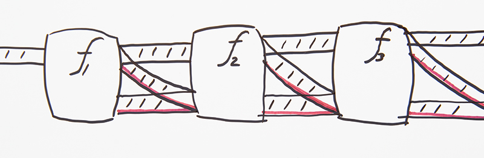
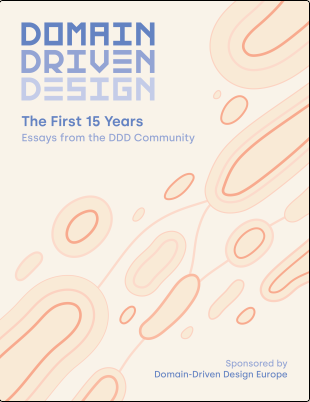

## DDD в действии

Руководство с примерами на Kotlin по внедрению Предметно Ориентированного Проектирования (Domain Driven Design) в команду и обращения её в безумную машину по доставке чистого кода.

С собой ты унесешь паттерн приложения с тестами на бизнес-логике и кучу полезных рекомендаций, которые работают.


Обсудим Сложности:

- не говорить про DDD
- внедрение в существующей команде
- рефакторинг существующего "старого кода" по кукбуку
- Ссылка на git [https://t.ly/pwgy](https://t.ly/pwgy)


email: maxim[at]codemonsters.team\
https://t.me/codemonsterslogs

«I am strong believer in a “begin with the concrete, and move to the abstract” pedagogical approach» © [Scott Wlaschin](https://fsharpforfunandprofit.com/about/)

«The problem contains the solution»

Как писать меньше кода с тестами - в кукбуке ответ.     
 
>DDD is not Done!   
>DDD 20 years

---

## **Вызовы:**
Повысить качество кода разработки приложений с бизнес-логикой и упростить контроль-передачу паттернов
### Бизнес
- [x] Снизить стоимость доработок
- [x] Снизить стоимость поддержки
- [x] Снизить стоимость погружения новичков
- [x] Сокращения количества ошибок

### Лид
Высвободить время лида разработки на программирование и развитие за счет
- [x] Повышения эффективности делегирования
- [x] Сокращения времени на проверку кода
- [x] Сокращения времени на осознание кода и на встречи «погружения разработчиков» в методологию
- [x] Задать шаблон разработки бизнес-логики

### Developer Advocate
- [x] Тесты - это невероятно веселый прагматичный процесс
- [x] DDD - это не сложно и эффективно

## **Задача:**
Которую получилось решить
````
  Найти рецепт на основе лучших практик, который поможет:
  - при создании приложений с бизнес-логикой 
  - в рефакторинге
  - контроле качества кода   
  с использованием набора практичных юнит-тестов, функциональной парадигмы.
  Применить подход на практике.
  Описать кратко и доступно рецепт.
  Внедрить в команде и обратить ее 
  в безумную машину по доставке чистого кода.
````
---
### Концепция кукбука 
OpenSource c пометками на изучение паттернов и их применение.

ShowStudio.com
Nick Knignt - открыл миру процесс производства рекламного изображения.  
    

Jamie Oliver - открыл миру простоту приготовления высокой кухни.  


---

На автора оказали влияние работы инженеров:\
[Владимира Хорикова](https://enterprisecraftsmanship.com/), [Скотта Влашина](https://fsharpforfunandprofit.com/), [Роберта Мартина](https://cleancoders.com/)  

Устремления к эффективным действиям, продуктивной работе и достижениям.

## DDD в действии : Рецепт

### DDD :: Качественная разработка - результат качественной коммуникации, а не постановки.

Разработка - это не просто программирование.
> Код - побочный эффект коммуникации


Eric Evans:  
> 
> Highly productive teams grow their knowledge consciously, practicing continuous learning (Kerievsky 2003). For developers, this means improving technical knowledge, along with general domain-modeling skills (such as those in this book). But it also includes serious learning about the specific domain they are working in.
> 

Dan North:  
> «Невежество — это самое большое препятствие на пути к пропускной способности»
 

Prof. David West:  
> «The amazing thing about DDD was not the patterns or the practices, it was the quiet way it put the lie to a fundamental tenets of software engineering: the lie that programmers did not need to have an understanding of domains, that everything they needed to know was a set of requirements that the code must satisfy.»

- [x] Разработчик - эксперт предметной области
- [x] Общаемся с экспертами и проектируем решения командой | Event Storming на свой лад
- [x] Прозрачность процессов vs Job Safety
- [x] Свобода ?: Уволиться одним днем

---
## Контекст задачи

### Команда и продукт

  


### Bounded Context 
*Ограничиваем контекст и учимся находить место бизнес-логике*  

Контекст Задачи Обновление Абонента\

### Границы ответственности сервиса Subscribers - по бизнес потокам:
  Абонент
  - Сотворение абонента
  - Изменение лояльности
  - *Обновление абонента* ~New 
    
Если просто Абоненты знают и умеют все про абонентов и могут обработать запрос на изменение данных абонента.
### Границы ответственности сервиса обновления данных
  Обновление данных

  - получает информацию из внешней системы об абоненте
  - получает информацию из внутренней системы об абоненте
  - формирует **запрос на обновление данных**

Общий контракт двух контекстов: **запрос на обновление данных**

---
## Организация процессов в команде
### Ubiquity Language
Общий язык - Единый язык в документации, коде, в общении с экспертами домена. 


#### Описываем тикеты, сопроводительную документацию
 - Все документы по обновлению данных лежат рядом в одном месте под рукой.
 - Нахрен поиски по типизировоанным разделам и когнетивную нагрузку при сборке в голове карты происходящего - облегчаем себе жизнь.
 - Документация к сервисам - в исходниках
 - Сопроводительную документацию собираем в одном разделе по бизнес-процессу
   


---
## Опиши верхнеуровнево в функциональном стиле бизнес-процесс
Описание должно просто ответить на вопрос:  
Что происходит в системе по бизнес-процессу?  

### Пример:

Чтобы обновить данные абонента, необходимо:
````
| получить данные для обновления абонента 
| запросить текущие данные абонента в системе
| сформировать запрос на обновление абонента
| отправить запрос обновления данных абонента
````
^ хорошо помогает в рефакторинге  
может оказаться так:  
- код делает не совсем то и не совсем так, что должен или много лишнего.  


 
### Отвратительный паттерн:

Разработчик сидит и ждет дательную постановку: 
что и как должно происходить в каком сервисе в какой таблице.  
Отвечают за все аналитики.   
  
Так все еще бывает:
````
   0. Снять с себя ответственность и кодить по постановке
   1. В таблице <обновление_данных> взять все строки со статусом need_to_update
   2. В таблице абонента взять данные по абоненту по идентификатору <обновление_данных>.subscriber_id,
      если таких данных нет, пометить ошибкой
   3. Сверить строки как то так.
   4. Если данные отличаются см. пункт 5
   5. Отдельная страница в конфлюенс на два скрола со сложной логикой обновления данных, 
      сиквенс диаграммой и т.д.
````
- [x] Чем плохи долгие постановки в конфлю с кучей информации по имплементации от аналитика?
- [x] Аналитикой в том числе занимается разработчик как эксперт предметной области
- [x] Забудь Table-Driven Design (Database Oriented мышление) - используй только Доменные объекты при обсуждении задачи. Не думай о низкоуровневой реализации.

---

## Перенесем документацию в Код

Помни: 

>Код - побочный эффект коммуникации

Постановка: 

````zsh
| запросить данные для обновления абонента
| запросить текущие данные абонента в системе
| сформировать запрос на обновление абонента
| отправить запрос обновления данных абонента
````

Пример кода из сервиса в стиле P.O.P.:  
```kotlin
@Service

fun dataUpdateProcess(unvalidatedUpdateRequest: UnvalidatedDataUpdateRequest)
: Mono<Result<SubscriberDataUpdateResponse>> =
    Mono.just(ValidatedDataUpdateRequest.emerge(unvalidatedUpdateRequest))
    .flatMap { findDataWithUpdates(it) }
    .flatMap { findSubscriberForUpdate(it) }
    .flatMap { prepareSubscriberUpdateRequest(it) }
    .flatMap { updateSubscriber(it) }
```

- P.O.P - [Pipeline Oriented Programming](https://www.youtube.com/watch?v=sfYA0HCWgqQ)

Scott Wlaschin:
  >Passing data through a pipeline of transformations
  >is an alternative approach to classic OOP
  
**Бенефиты**:
  - код есть документация - просто читать не только программисту
  - это всегда однонаправленный поток, даже с ответвлениями
  - упрощает компоновку шагов
  - помогает следовать принципам хорошего дизайна  

- | Волшебство Unix Pipe Головного Мозга

 ````zsh
  curl | jq | more
  ls -la | grep 
```` 
>A pipe is a form of redirection
>(transfer of standard output to some other destination)
>that is used in Linux and other Unix-like operating systems to
>send the output of one command/program/process to another.
>А что если я разработчик и У меня windows?

---
## Какие паттерны нам помогут описать бизнес-процесс так просто?

- [x] **R.O.P Railway Oriented Programming in Error Handling**
- [x] **Сильная Доменная модель | Rich Domain Model**
- [x] Type Driven Development другое TDD
- [x] Onion Architecture
- [x] TDD: Классическая школа Тестирования и совсем немного лондонского вайба

Соберем все это в чистый код в функциональной парадигме?

---
Я выделю две центральные идеи вокруг которых все прочно выстраивается:  
## Две крепости тактических паттернов в функциональной парадигме DDD

- [x] **R.O.P Railway Oriented Programming in Error Handling**
- [x] **Сильная Доменная модель | Rich Domain Model**

___

## R.O.P - Railway Oriented Programming in Error Handling

**Задача**:  
- [x] Не используем исключения в качестве control flow

Ни в модели ни в интеграционных взаимодействиях  

>Исключения как инструмент мешают в восприятии бизнес-процесса, как **непрерывного потока**.


Мы используем [Railway Oriented Programming - error handling in functional languages](https://fsharpforfunandprofit.com/rop/) как паттерн при работе с ошибками.  



Постановка:  

````zsh
| запросить данные для обновления абонента
| запросить текущие данные абонента в системе
| сформировать запрос на обновление абонента
| отправить запрос обновления данных абонента
````

Пример кода из сервиса в стиле R.O.P.:  
```kotlin
@Service

fun dataUpdateProcess(unvalidatedUpdateRequest: UnvalidatedDataUpdateRequest)
: Mono<Result<SubscriberDataUpdateResponse>> =
    Mono.just(ValidatedDataUpdateRequest.emerge(unvalidatedUpdateRequest))
    .flatMap { findDataWithUpdates(it) }
    .flatMap { findSubscriberForUpdate(it) }
    .flatMap { prepareSubscriberUpdateRequest(it) }
    .flatMap { updateSubscriber(it) }
```

## Решение R.O.P.

Чистая функция   

> **in**  > Two Track Type : Result<Data, Error>  
> **out** > Two Track Type : Result<Data, Error>
 
### True pure and honest function style    
функция всегда возвращает ответ: **Two Track Type : Result<Data, Error>**  
если она может «сломаться» в процессе исполнения.  

Пример сервиса в стиле R.O.P.:  

````kotlin
   fun dataUpdateProcess(
    unvalidatedUpdateRequest: UnvalidatedDataUpdateRequest
   ): Mono<Result<SubscriberDataUpdateResponse>> =
    Mono.just(ValidatedDataUpdateRequest.emerge(unvalidatedUpdateRequest))
        .flatMap { findDataWithUpdates(it) }
        .flatMap { findSubscriberForUpdate(it) }
        .flatMap { prepareSubscriberUpdateRequest(it) }
        .flatMap { updateSubscriber(it) }          
       ...
       ...

    // > Result IN > Result OUT
    private fun prepareSubscriberUpdateRequest(
        subscriberDataUpdate: Result<SubscriberDataUpdate>
    ): Mono<Result<SubscriberUpdateRequest>> =
    subscriberDataUpdate.fold(
        onSuccess = { it.prepareUpdateRequest() },
                      //^ Бизнес-логика в Доменном классе
        onFailure = { Result.failure(it) }
                     //^ ошибку пробрасываем далее по пайпу процесса
    ).toMono()    

````
> Fold In functional programming, fold (also termed reduce, accumulate, aggregate, compress, or inject)

> Can Execute/ Execute pattern  
> imperative style
````kotlin
private fun prepareSubscriberUpdateRequest(
    subscriberDataUpdate: Result<SubscriberDataUpdate>
): Result<SubscriberUpdateRequest> {
  if(subscriberDataUpdate.isSuccess) {
      return subscriberDataUpdate.data.prepareUpdateRequest()
  } else {
      Result.failure(subscriberDataUpdate.error)
  }      
} 
````
> Filter Style in pipe
> 

````kotlin
private fun prepareSubscriberUpdateRequest(
    subscriberDataUpdate: Result<SubscriberDataUpdate>
): Mono<Result<SubscriberUpdateRequest>> =
     Mono.just(subscriberDataUpdate)
         .filter{it.isSuccess}
         .map {it.getOrThrow()}
         .map{it.prepareUpdateRequest()}
         .switchIfEmpty(throwErrorFronInput(it))
````
#### Вывод:
- [x] Не используем исключения в качестве control flow
  >С two track type **Result**<Data, Error> обработка ошибок становится гражданином первого класса нашей модели
- [x] **исключения для нас исключительно сигналы багов!**
- [x] чистые функции

---

## Сильная Доменная модель | Rich Domain Model
Логика описана в доменных классах, не в сервисах:

````kotlin
//AggregateRoot
data class SubscriberDataUpdate private constructor(
    private val dataUpdate: DataUpdate,
    private val subscriber: Subscriber
) {

    fun prepareUpdateRequest(): Result<SubscriberUpdateRequest> =
        when (isUpdateRequired()) {
            true -> createSubscriberUpdateRequest()
            else -> failNoUpdateRequired()
        }

    private fun isUpdateRequired(): Boolean =
        subscriber.mobileRegionId != dataUpdate.mobileRegionId

    private fun failNoUpdateRequired(): Result<SubscriberUpdateRequest> =
        Result.failure(RuntimeException("No Update Required"))

    private fun createSubscriberUpdateRequest()
            : Result<SubscriberUpdateRequest> =
        Result.success(
            SubscriberUpdateRequest(
                subscriberId.value,
                dataUpdate.msisdn.value,
                dataUpdate.mobileRegionId.value,
                this
            )
        )
}
````
#### Бенефиты:
- бизнес-логика собрана в одном месте Domain Layer
- направляет нас на подконтрольное создание, проверку и управление сущностью, предотвращая появление у клиента сущностей с несогласованным состоянием сразу в одном месте
- код превращается в документацию, которую просто тестировать

### Не используй анти-паттерн [Слабая Доменная Модель](https://www.martinfowler.com/bliki/AnemicDomainModel.html)  

````kotlin 
      data class Subscriber(
            val subscriberId: String,
            val msisdn: String, 
            val mobileRegionId: String
      )
  
````

#### Чем плоха слабая доменная модель?
- Инкапсуляция нарушена
- Приводит всегда к Дублированию бизнес-логики
- Невозможно гарантировать, что объекты в модели находятся в согласованном состоянии
- всегда способствует разрыву и непониманию между разработкой и бизнесом
- всегда приводит к описанию бизнес-логики в отдельном месте, например сервисе и сливается в этом случае с интеграцией.

чем плохо слияние с интеграцией?

- тем что тестирование бизнес-логики возможно только мокам
- Чем опасны интеграционные методы подробно описано [в моей статье на Хабре](https://habr.com/ru/companies/gazprombank/articles/722620/)

- Слабая доменная модель - [**описание анти-паттерна сайте Martin Fowler**](https://martinfowler.com/bliki/AnemicDomainModel.html)

### Мы описали класс сильной доменной моделью, протестируем его?  

````kotlin
internal class SubscriberDataUpdateTest {

    @Test
    fun success() {
        //arrange
        val foundDataUpdateDto = DataUpdateDto(
            dataUpdateId = "101",
            subscriberId = "888",
            msisdn = "3338887770",
            mobileRegionId = "9" //<
        )
        val foundSubscriberDto = SubscriberDto(
            subscriberId = "888",
            msisdn = "3338887770",
            mobileRegionId = "0" //<
        )

        val dataUpdate = DataUpdate.emerge(
            foundDataUpdateDto
        ).getOrThrow()
        val subscriberResult = Subscriber.emerge(
            foundSubscriberDto
        )
        //^ воссоздаем необходимое нам состояние Обновление абонента
        //act
        val sut = SubscriberDataUpdate.emerge(dataUpdate, subscriberResult)
        //assert
        //i like fluent assertion library assertJ
        assertThat(sut.isSuccess).isTrue
        assertThat(sut.getOrThrow().prepareUpdateRequest().isSuccess).isTrue
        val subscriberUpdateRequest = sut.getOrThrow()
            .prepareUpdateRequest().getOrThrow()
        assertThat(subscriberUpdateRequest.subscriberId).isEqualTo("888")
        assertThat(subscriberUpdateRequest.msisdn).isEqualTo("3338887770")
        assertThat(subscriberUpdateRequest.mobileRegionId).isEqualTo("9")
    }
    
    //fails in da src

}
````
## DDD :: Aggregate

Eric Avans:
> An AGGREGATE is a cluster of associated objects that we treat as a unit for the purpose of data changes.

Scott Wlaschin:
> An aggregate plays an important role when data is updated. The aggregate acts as the consistency boundary: when one part of the aggregate is updated, other parts might also need to be updated to ensure consistency.  
>
> The aggregate is also where any invariants are enforced.
>

````kotlin
//AggregateRoot
data class SubscriberDataUpdate private constructor(
    private val dataUpdate: DataUpdate,
    private val subscriber: Subscriber
) {
    fun prepareUpdateRequest(): Result<SubscriberUpdateRequest> = {..}
    private fun isUpdateRequired(): Boolean = {..}
    private fun failNoUpdateRequired(): Result<SubscriberUpdateRequest> = {..}
    private fun createSubscriberUpdateRequest(): Result<SubscriberUpdateRequest> = {..}
}
````

---

## TDD :: Type Driven Development как защита от багов на уровне компиляции
>Кодопись без примитивов в ядре доменной модели - сам себя тестирует
>и описывает ограничения предусмотренные бизнес-логикой.
>Код есть документация.
>Появляется Единственная точка входа в процесс валидации.

Реализация Тактического Паттерна **DDD: ValueObject**
> ValueObject - Основной кирпичик описания модели - это важно понимать.
> Помогает строить всегда валидную доменную модель!


Пример SubscriberId:  

````kotlin
data class SubscriberId
private constructor(
    override val value: String
) : ValueObject<String> {
    companion object {
        fun emerge(subscriberId: String)
                : Result<SubscriberId> =
            when (isStringConsists6Digits(subscriberId)) {
                true -> Result.success(SubscriberId(subscriberId))
                else -> Result.failure(IllegalArgumentException("..."))
            }

        private val isStringConsist6Digits = "^\\d{1,6}\$".toRegex()

        private fun isStringConsists6Digits(value: String) =
            isStringConsist6Digits.matches(value)
    }
} 
````

Представили Тест на эту логику?

````kotlin
internal class SubscriberIdTest {
  @Test
  fun success() {
    val sut = SubscriberId.emerge("888")
    assertThat(sut.isSuccess).isTrue
    assertThat(sut.getOrThrow().value).isEqualTo("888")
  }

  @Test
  fun successWith6Digits() {
    val sut = SubscriberId.emerge("123456")
    assertThat(sut.isSuccess).isTrue
    assertThat(sut.getOrThrow().value).isEqualTo("123456")
  }

  @Test
  fun failWithWrongFormat() {
    val sut = SubscriberId.emerge("L124S")
    assertThat(sut.isFailure).isTrue
    assertThat(sut.exceptionOrNull()!!.message).isEqualTo("Subscriber Id consists of numbers maximum length 6")
  }

}
````

## Всегда валидная Последовательность алгебраических типов

> DDD made functional

Для описания Доменных классов в функциональном стиле помогает  
описать бизнес-процесс в цепочке перетекающих классов друг в друга:  

Постановка:    

````
| запросить данные для обновления абонента
| запросить текущие данные абонента в системе
| сформировать запрос на обновление абонента
| отправить запрос обновления данных абонента
````
Последовательность алгебраических типов:  

```
| Непроверенный Запрос на Обновление | UnvalidatedDataUpdateRequest
| Проверенный Запрос На Обновление   | ValidatedDataUpdateRequest
| Запрос Абонента В Системе          | SubscriberDataUpdate
| Запрос На Обновление Абонента      | SubscriberUpdateRequest
| Результат Обновления Абонента      | SubscriberDataUpdateResponse
```

Пример плохого возможно Невалидного Доменного класса:
````kotlin
   class SubscriberDataUpdate(
           val subscriber: Subscriber?, 
           val dataUpdate: SubscriberDataUpdate
     ) {
           fun isValid() = null != subscriber

           fun isUpdateRequired() = 
              subscriber.mobileRegionId != dataUpdate.mobileRegionId 
   }
````

Всегда валидная Доменная модель возникает только благодаря фабричным методам,\
или не возникает вовсе:

````kotlin   
data class SubscriberDataUpdate private constructor(
    private val dataUpdate: DataUpdate,
    private val subscriber: Subscriber
) {
    fun prepareUpdateRequest(): Result<SubscriberUpdateRequest> = {..}

    private fun failNoUpdateRequired(): Result<SubscriberUpdateRequest> = {..}

    private fun createSubscriberUpdateRequest()
            : Result<SubscriberUpdateRequest> = {..}
        
    private fun isUpdateRequired(): Boolean = {..}
    
    companion object {
        fun emerge(
            dataUpdate: DataUpdate,
            subscriberResult: Result<Subscriber>
        ): Result<SubscriberDataUpdate> =
            subscriberResult.map {
                SubscriberDataUpdate(dataUpdate, it)
            }
    }
    
}
````

- Остановись на валидации Запроса
> | Непроверенный Запрос на Обновление | UnvalidatedDataUpdateRequest

 
> DTO -> UnvalidatedDataUpdateRequest(a: String, b:String, c: String, d: String)
> 
> Result.zip(ValueObject<A>, ValueObject<B>, ValueObject<C>, ValueObject<D>).map{..}

````kotlin
fun <A : Any, B : Any, C : Any, D : Any> Result.Companion.zip(a: Result<A>, b: Result<B>, c: Result<C>, d: Result<D>)
: Result<Tuple4<A, B, C, D>> =
    if (sequenceOf(a, b, c, d).none { it.isFailure })
        Result.success(Tuples.of(a.getOrThrow(), b.getOrThrow(), c.getOrThrow(), d.getOrThrow()))
    else
        Result.failure(sequenceOf(a, b, c, d).first { it.isFailure }.exceptionOrNull()!!)
````

#### Onion Architecture : Изолируем доменную модель от интеграций

[Onion Architecture](http://jeffreypalermo.com/blog/the-onion-architecture-part-1/)

Уровень сервисов используем как простой поток **dump pipe**

Как это помогает в **тестописи**?


Постановка:
````
| запросить данные для обновления абонента
| запросить текущие данные абонента в системе
| сформировать запрос на обновление абонента
| отправить запрос обновления данных абонента
````
Пример сервиса с Сильной Доменной Моделью:

````kotlin
    fun dataUpdateProcess(unvalidatedUpdateRequest: UnvalidatedDataUpdateRequest)
            : Mono<Result<SubscriberDataUpdateResponse>> =
        Mono.just(ValidatedDataUpdateRequest.emerge(unvalidatedUpdateRequest))
            .flatMap { findDataWithUpdates(it) }
            .flatMap { findSubscriberForUpdate(it) }
            .flatMap { prepareSubscriberUpdateRequest(it) }
            .flatMap { updateSubscriber(it) }

     private fun findSubscriberForUpdate(dataUpdate: Result<DataUpdate>)
            : Mono<Result<SubscriberDataUpdate>> =
        dataUpdate.fold(
            onSuccess = { subscriberRequest -> findSubscriberByRest(subscriberRequest) },
            onFailure = { error -> Mono.just(Result.failure(error)) }
        )

     private fun findSubscriberByRest(dataUpdate: DataUpdate)
        : Mono<Result<SubscriberDataUpdate>> =
        _subscribersClient.findSubscriber(dataUpdate.subscriberId)
        .map { SubscriberDataUpdate.emerge(dataUpdate, it) }

````

---
## YAGNI + KISS самые ценные принципы 
[YAGNI + KISS как самые ценные принципы проектирования](https://enterprisecraftsmanship.com/posts/most-valuable-software-development-principles/)
  
  YAGNI — "You aren’t gonna need it"\
  KISS  — "Keep it simple, stupid" or "Keep it short and simple"
- [x] проектируем только то, что нужно в моменте : может вообще не взлететь
- [x] Улучшай структуру кода и уменьшай количество слоев\
      Простая структура уменьшает когнитивную нагрузку, упрощает работу с кодом.
````
    ddd.toolkit
      controller
      domain
        common
        subscriberDataUpdate
      utils
    
````
- [x] никаких универсальных надстроек и шаблонов. Домен уникален сам по себе\
      The simpler your solution is, the better you are as a software developer.
  
````
         ddd.toolkit
           controller
           domain
             common
             subscriberDataUpdate
                DataUpdate
                Subscriber
                SubscriberDataUpdate
                SubscriberDataUpdateRequest
                SubscriberDataUpdateResponse
                SubscriberDataUpdateService
                SubscriberGateway
                SubscriberRestClient
           utils
         
````

---
## TDD :: классическая школа
Прагматичный набор тестов, сфокусированный на бизнес-логике

TDD — "Test Driven Development"  
TDD — это надежный способ проектирования программных компонентов.  
Тесты помогают писать код лучше, если поставить задачу:  
- [x] **Покрой юнит-тестами бизнес-логику, которая содержится в Доменной Модели**
- [x] тест - это документация - должен быть максимально простым:
 ````
 /**
 4 аспекта хороших юнит-тестов:
  1) защита от багов
  2) устойчивость к рефакторингу
  3) быстрая обратная связь
  4) простота поддержки\
 **/
 @Test
 fun success() {
   //arrange
   val foundDataUpdateDto = DataUpdateDto(
       dataUpdateId = "101",
       subscriberId = "909",
       msisdn = "9999999999",
       mobileRegionId = "9" //< изменение региона
   )
   val foundSubscriberDto = SubscriberDto(
       subscriberId = "909",
       msisdn = "9999999999",
       mobileRegionId = "0" //< текущее состояние региона
   )

   val dataUpdate = DataUpdate.emerge(
       Result.success(foundDataUpdateDto)
   ).getOrThrow()
   val subscriberResult = Subscriber.emerge(
       Result.success(foundSubscriberDto)
   )   //^ моки не нужны
        
   //act
   val sut = SubscriberDataUpdate.emerge(dataUpdate, subscriberResult)
    // ^ SUT - sysyem under test
        
   //assert
   assertThat(sut.isSuccess).isTrue
   assertThat(sut.getOrThrow()
                 .prepareUpdateRequest().isSuccess
              )
              .isTrue
   val subscriberUpdateRequest = sut.getOrThrow()
                                    .prepareUpdateRequest()
                                    .getOrThrow();
   assertThat(subscriberUpdateRequest.subscriberId).isEqualTo("909")
   assertThat(subscriberUpdateRequest.msisdn).isEqualTo("9999999999")
   assertThat(subscriberUpdateRequest.mobileRegionId).isEqualTo("9")
 }
````
Пример «трудного» теста:
````
 @Test
 void getExistingIdsBetweenInAscByReportDt ()
 {
     changeDataRepository.getExistingIdsBetween(1L, 5L)
         .concatMap(id -> changeDataRepository.findById(id))
     .collectList()
     .as(StepVerifier::create)
     .consumeNextWith(changeData -> {
         var reportDts = 
             changeData
                .stream()
                  .map(ChangeData::getReportDateTime)
                  .collect(Collectors.toList());
                  log.info("list report_dt: {}", reportDts);
         assertThat(reportDts)
           .isSortedAccordingTo(Comparator.naturalOrder());
     })
     .verifyComplete();
 }

````

- [x] не использовать моки\
   Не думай о деталях реализации тестируемой системы,\
   думай о ее выходных данных.
- [x] тестировать выходные данные функции, если тестируем состояние - это компромисс.
- [x] минимизировать количество интеграционных тестов.
>Один тест покрывает максимум возможных интеграций – максимум кода.  
Проверь «Счастливый путь» и до 3-х крайних точек с ошибками по процессу  
Как правило интеграционного теста на одну ошибку хватает.  
Все ошибки тестируем юнит-тестами.  

Пример интеграционного теста:

 ````
 class SubscriberDataUpdateControllerTest(
          @Autowired val webTestClient: WebTestClient
 ) {
 ...
    
 @Test
 fun updateSuccess() {
   webTestClient.put()
       .uri("/api/v1/subscriber-data-updates")
       .bodyValue(RestRequest(DataUpdateRequestDto(dataUpdateId = "101")))
       .exchange()
       .expectStatus().isOk
       .expectBody()
       .jsonPath("@.actualTimestamp").isNotEmpty
       .jsonPath("@.status").isEqualTo("success")
       .jsonPath("@.data.subscriberId").isEqualTo("999")
       .jsonPath("@.data.dataUpdateId").isEqualTo("101")
 }
 }
  
 ````
При таком подходе к дизайну кода мы получаем из коробки качественное покрытие тестами  


Этот подход прекрасно вписывается в строительство пирамиды в команде:  


Что пишут QA в нашем случае и как это может помочь при рефакторинге?

### Что дальше?
+ BDD

## Вывод
DDD is good and simple not simple!

## Обсудим сложности
- принять лидерство
- не говорить про DDD
- внедрение в существующей команде
- рефакторинг существующего "старого кода" по кукбуку

### Рецепт:
- Стань экспертом предметной области – разберись что и как должно работать на всех уровнях.  
Твой код – твоя ответственность.  
И помни:  
Качественная разработка – это результат качественной коммуникации.  
- Опиши в функциональном стиле бизнес-процесс с доменными классами
- Реализуй в функциональном стиле всегда валидную Богатую Доменную Модель без примитивов
- Покрой юнит-тестами бизнес-логику, которая содержится в Доменной Модели
- Запусти Доменную Модель по тоннелю «бизнес-процесс» без исключений, 
  на шлюзах поможет two track type Result<Data, Error> и canExecute/execute.

По рецепту возможно получить в качестве результата:
- Простую и строгую структуру приложения - хороший дизайн кода в функциональным стиле
- Код будет оснащен эффективным набором простых юнит-тестов:
  - которые сфокусированы на изолированной от интеграций бизнес-логике
  - Количество интеграционных тестов сведено к достаточному минимуму
    - Интеграционные тесты более дорогие в сопровождении и поддержке
  - Моки не используются вообще или в крайне исключительных ситуациях

перед пушем запускай:
````
./gradlew test
````


**The best code is the one that has never been written** © [Vladimir Khorikov](https://enterprisecraftsmanship.com/posts/most-valuable-software-development-principles/)

**This is The Way** © The Mandalorian

---
Оставьте, пожалуйста, отзыв о выступлении!

https://t.ly/uf7j  


---

Книги:

[](https://www.piter.com/product_by_id/212580594)

[](https://pragprog.com/titles/swdddf/domain-modeling-made-functional/)

[](https://leanpub.com/ddd_first_15_years/)


[](http://manifesto.softwarecraftsmanship.org/#/ru-ru)

[Agile Manifesto](https://agilemanifesto.org/)

## Полезные ссылки
- [x] [There is no I in Software Craftsmanship](https://betterprogramming.pub/there-is-no-i-in-software-development-4ec478631d6b)
- [x] [книга: Domain Modeling Made Functional](https://pragprog.com/titles/swdddf/domain-modeling-made-functional/)
- [x] [книга: Принципы юнит-тестирования](https://www.piter.com/product_by_id/212580594)
- [x] [книга: Domain-Driven DesignThe First 15 Years](https://leanpub.com/ddd_first_15_years/)
- [x] [Video :: Scott Wlaschin — Pipeline-oriented programming](https://www.youtube.com/watch?v=sfYA0HCWgqQ)
- [x] [Video :: Scott Wlaschin - Railway Oriented Programming — error handling in functional languages](https://vimeo.com/97344498)
- [x] [Видео :: Владимир Хориков — Domain-driven design: Cамое важное](https://youtu.be/JOy_SNK3qj4)
- [x] [Видео :: Ахтям Сакаев — DDDamn good!](https://youtu.be/JUrMIBR8Tmk)
- [x] [Vladimir Khorikov, Refactoring from Anemic Domain Model Towards a Rich One](https://www.pluralsight.com/courses/refactoring-anemic-domain-model)
- [x] [Vladimir Khorikov, Applying Functional Principles : pluralsight](https://www.pluralsight.com/courses/csharp-applying-functional-principles)
- [x] [OCP vs YAGNI](https://enterprisecraftsmanship.com/posts/ocp-vs-yagni/)
- [x] [Validation and DDD](https://enterprisecraftsmanship.com/posts/validation-and-ddd/)
- [x] [canExecute/Execute](https://enterprisecraftsmanship.com/posts/validation-and-ddd/)
- [x] [7 Software Development Principles That Should Be Embraced Daily](https://betterprogramming.pub/7-software-development-principles-that-should-be-embraced-daily-c26a94ec4ecc)
- [x] [primitive obsession](https://enterprisecraftsmanship.com/posts/functional-c-primitive-obsession/)
- [x] http://dddcommunity.org/
- [x] http://eventstorming.com/
- [x] [Visualising software architecture](http://static.codingthearchitecture.com/c4.pdf)
- [x] https://www.martinfowler.com/bliki/MicroservicePremium.html
- [x] [AnemicDomainModel](https://martinfowler.com/bliki/AnemicDomainModel.html).
- [x] http://www.enterpriseintegrationpatterns.com/patterns/messaging/MessageRouter.html
- [x] https://www.slideshare.net/BerndRuecker/long-running-processes-in-ddd
- [x] https://martinfowler.com/eaaCatalog/dataTransferObject.html
- [x] https://www.infoq.com/articles/consumer-driven-contracts
- [ ] [Conway's Law](https://www.thoughtworks.com/radar/techniques/inverse-conway-maneuver)
- [x] http://jeffreypalermo.com/blog/the-onion-architecture-part-1/
- [x] http://alistair.cockburn.us/Hexagonal+architecture
- [x] https://8thlight.com/blog/uncle-bob/2012/08/13/the-clean-architecture.html
- [x] https://fsharpforfunandprofit.com/posts/type-inference/
- [x] https://en.wikipedia.org/wiki/Data-oriented_design
- [ ] http://www.melconway.com/Home/Committees_Paper.html
- [ ] https://www.enterpriseintegrationpatterns.com/ramblings/18_starbucks.html
- [ ] http://vasters.com/archive/Sagas.html
- [x] [tdd best practices](http://blog.stevensanderson.com/2009/08/24/writing-great-unit-tests-best-and-worst-practises/)
- [ ] [What Is Software Design? by Jack W. Reeves](https://www.developerdotstar.com/mag/articles/reeves_design.html)
- [x] http://alistair.cockburn.us/Hexagonal+architecture
- [x] [monad](http://bit.ly/monad-paper)
- [x] [Railway-Oriented-Programming-Example](https://github.com/swlaschin/Railway-Oriented-Programming-Example)
- [x] [CQRS](https://enterprisecraftsmanship.com/posts/cqrs-commands-part-domain-model/)
- [x] [DTO vs Value Object vs POCO](https://enterprisecraftsmanship.com/posts/dto-vs-value-object-vs-poco/)
- [x] [Value Objects](https://enterprisecraftsmanship.com/posts/value-objects-explained/)
- [x] [pipeline oriented](https://fsharpforfunandprofit.com/pipeline/)
- [x] [type-inference](https://fsharpforfunandprofit.com/posts/type-inference/)
- [x] [Sealed Classes Instead of Exceptions in Kotlin](https://phauer.com/2019/sealed-classes-exceptions-kotlin/)